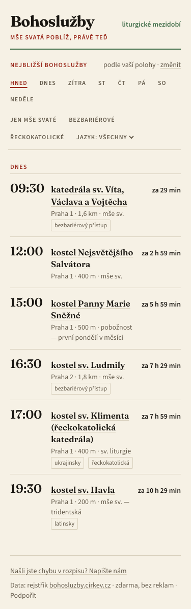
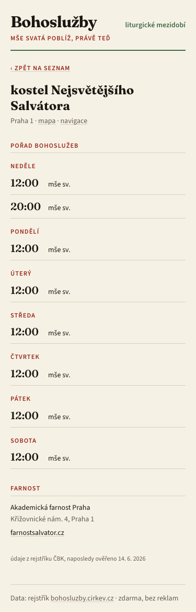

# Bohoslužby

**[bohosluzby.dravec.org](https://bohosluzby.dravec.org)** — mše svatá poblíž,
právě teď. Mobilní webová aplikace, která najde nejbližší katolické bohoslužby
v ČR podle vaší polohy a seřadí je podle toho, kterou ještě stihnete.

- **Hned / dnes / zítra / neděle** — přepínač dne funguje jako listování v ordu:
  „kdy je v neděli mše?"
- **Detail kostela** — týdenní pořad bohoslužeb, mimořádné bohoslužby, farnost
  a kontakty, odkaz na mapu (mapy.cz / navigace).
- **Filtry** — jen mše svaté, bezbariérové, řeckokatolické, jazyk.
- **Do kalendáře** — každá bohoslužba se dá stáhnout jako opakovaná událost
  (ICS); každý kostel má sdílitelný odkaz `/kostel/<id>/`.
- **Offline** — celý dataset (~1,3 MB) se ukládá do zařízení; aplikace funguje
  bez signálu a pamatuje si poslední polohu.
- Zdarma, bez reklam, bez registrace, bez cookies.

| | |
|---|---|
|  |  |

## Data a jejich čerstvost

Data pocházejí z oficiálního rejstříku bohoslužeb České biskupské konference,
[bohosluzby.cirkev.cz](https://bohosluzby.cirkev.cz). Rejstřík aktualizují
farnosti samy a některé záznamy jsou starší — aplikace proto u každého kostela
poctivě uvádí „naposledy ověřeno" s datem z rejstříku. **Před cestou si čas
raději ověřte ve farnosti.**

Dataset je uložený v repozitáři (`public/data/`); obnovuje se skriptem
`node data/extract.mjs` (šetrně, max. 3 požadavky/s, s lokální cache).

## Vývoj

```bash
npm ci
npm run dev        # http://localhost:5173
npm run typecheck && npm test && npm run build
npx playwright test   # e2e journeys + screenshoty do e2e/shots/
```

Build/test/release kontrakt: `AGENTS.md`. Vizuální kontrakt (misálová
typografie, liturgické barvy): `docs/DESIGN-BRIEF.md`.

## Licence

Kód: [MIT](LICENSE). Údaje o bohoslužbách: rejstřík ČBK
(bohosluzby.cirkev.cz) — autorská a databázová práva náleží jejich správci.
